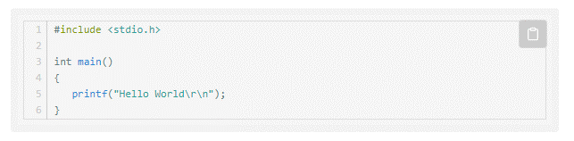

## 起步

代码展示样式，将 [highlightjs][4] 制作为typecho插件形式。

Mr.Chip@2024 增加了copy按钮的功能

## 使用方法

第一步：下载本插件，放在 `usr/plugins/` 目录中；

第二步：文件夹名改为CodeStyle；

第二步：登录管理后台，激活插件；

## 与我联系：
github开源地址：[https://github.com/mrchipset/CodeStyle_for_typecho][5]

作者：Mr.Chip
主页：[https://www.xtigerkin.com][6]

如果有任何问题请随意添加issue，看到后会回复讨论。

## 与原作者联系
原作github开源地址：[https://github.com/hongweipeng/CodeStyle_for_typecho][1]

作者：hongweipeng

主页：[https://www.hongweipeng.com/][2]

或者通过 Emai: hongweichen8888@sina.com

有任何问题也可评论留言

## 感谢
代码行显示支持:

[https://github.com/wcoder/highlightjs-line-numbers.js][3]

代码拷贝的支持：

[https://github.com/arronhunt/highlightjs-copy][7]

[1]: https://github.com/hongweipeng/MenuTree_for_typecho
[2]: https://www.hongweipeng.com/
[3]: https://github.com/wcoder/highlightjs-line-numbers.js
[4]: https://highlightjs.org/
[5]: https://github.com/mrchipset/CodeStyle_for_typecho
[6]: https://www.xtigerkin.com
[7]: https://github.com/arronhunt/highlightjs-copy