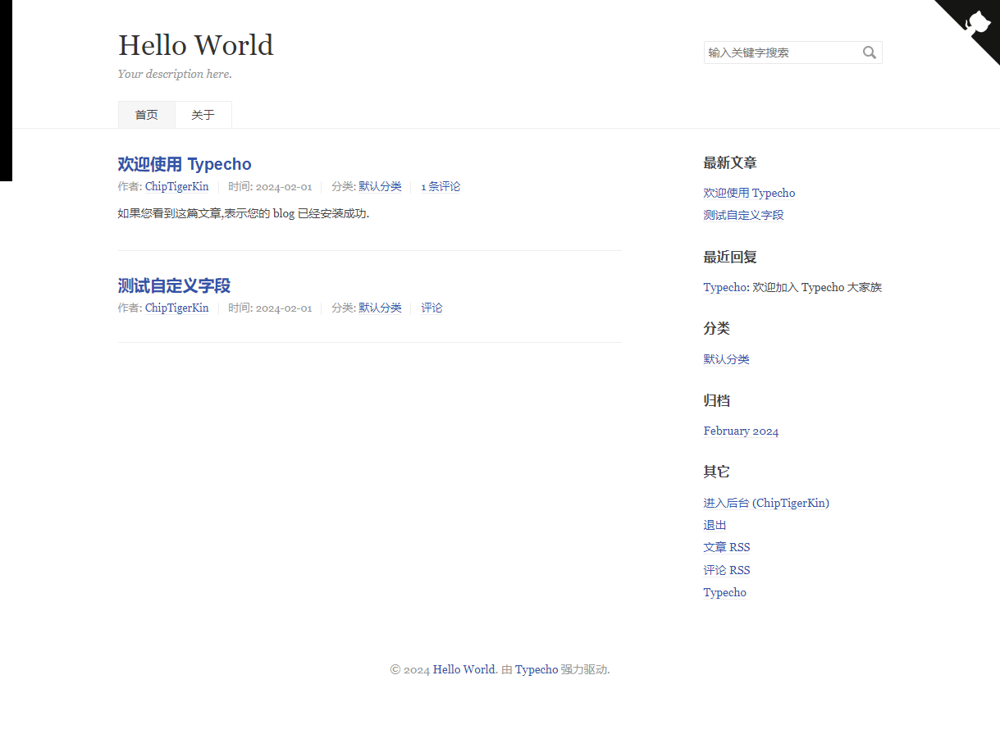
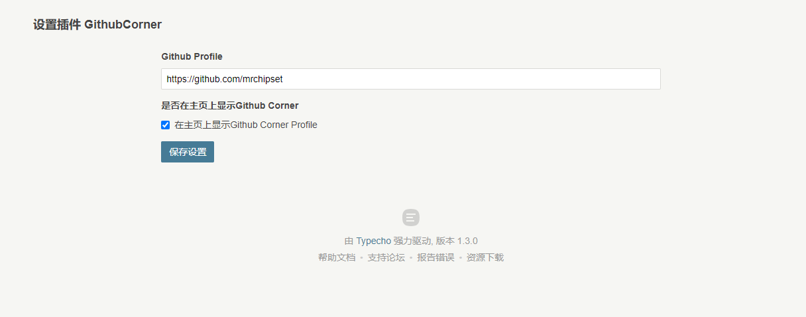
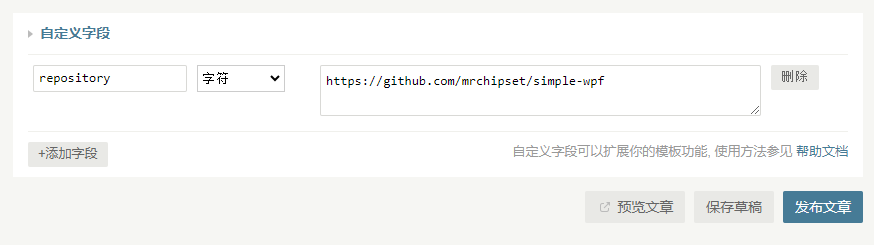

# GithubCorner
English / [简体中文](./README_CN.md)

A typecho plugin to link to Github profile or repository on the website corner

### Plugin Setup

In the plugin setup form, users are allowed to setup the Github Profile URL and check whether to show the Corner Widget on index page.

### Post setup

Add a specific custom field named `repository` with the URL to your repository. The corner on that post will link to the filled URL.

### Acknowledgement
Thanks to [@tholman](https://github.com/tholman)! Github corner widget is referenced from [https://github.com/tholman/github-corners](https://github.com/tholman/github-corners)