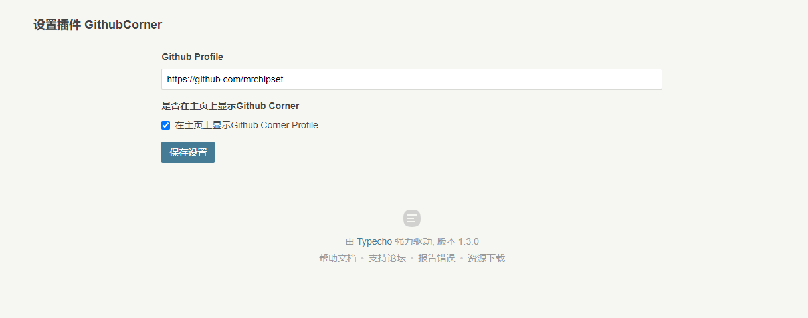
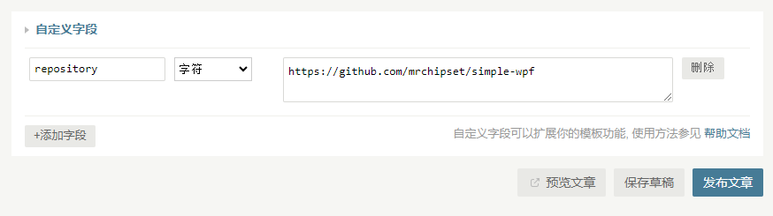

# GithubCorner
[English](./README.md) / 简体中文

一个将Github的个人页面或者代码仓库链接到博客右上角的插件

### 插件设置

在插件设置当中可以设置Github个人地址并配置是否在首页显示.

### 文章设置

在发布文章时添加自定义字段`repository` 填入自己的Github仓库地址. Github图标将在设置了该字段的文章页显示，并连接到设置的链接。

### 致谢
感谢[@tholman](https://github.com/tholman)! Github角标组件完全由其开源的仓库修改而来：[https://github.com/tholman/github-corners](https://github.com/tholman/github-corners)